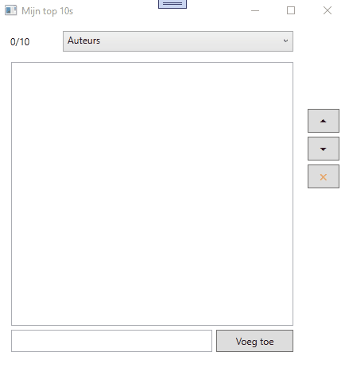

# Oefening lussen : mijn top 10's  

Bestudeer onderstaande filmpje aandachtig.  Het is de bedoeling dat je nu zelf eens de logica achter dit programma uitzoekt.  

Je zal merken dat er in je starterscode al een beetje code aanwezig is.  Je krijgt een array van 6 elementen waarin de verschillende categorien zitten die in de combobox bovenaan je venster dienen getoond te worden.  
De rest probeer je zelf op te lossen ...  

Succes!

